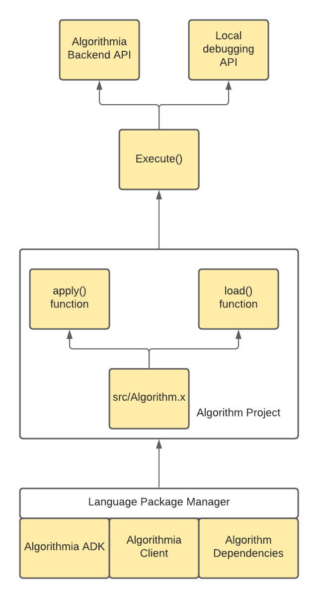

# Algorithm Development Kit (ADK), Python edition 
```python
import Algorithmia
# API calls will begin at the apply() method, with the request body passed as 'input'
# For more details, see algorithmia.com/developers/algorithm-development/languages

def apply(input):
    return "hello {}".format(str(input))
algo = Algorithmia.handler(apply)
algo.serve()
```

This document will describe the following:
- What is an Algorithm Development Kit
- Changes to Algorithm development
- Example workflows you can use to create your own Algorithms.


## What is an Algorithm Development Kit
An Algorithm Development Kit is a package that contains all of the necessary components to convert a regular application into one that can be executed and run on Algorithmia.
To do that, an ADK must be able to communicate with [langserver](https://github.com/algorithmiaio/langpacks/blob/develop/langpack_guide.md).
To keep things simple, an ADK exposes some optional functions, along with an `apply` function that acts as the explicit entrypoint into your algorithm.
Along with those basics, the ADK also exposes the ability to execute your algorithm locally, without `langserver`; which enables better debuggability.



This kit, when implemented by an algorithm developer - enables an easy way to get started with your project, along with well defined hooks to integrate with an existing project.


## Changes to Algorithm Development

Algorithm development does change with this introduction:
- Primary development file has been renamed to `src/Algorithm.py` to aide in understanding around what this file actually does / why it's important
- An additional import (`from Algorithmia import Handler`)
- An optional `load()` function that can be implemented
    - this enables a dedicated function for preparing your algorithm for runtime operations, such as model loading, configuration, etc
- A call to the handler function with your `apply` and optional` load` functions as inputs
    - ```python
      algo = Algorithmia.handler(apply)
      algo.serve()
      ```
    - converts the project into an executable, rather than a library
      - which will interact with the `langserver` service on Algorithmia
      - but is debuggable via stdin/stdout when executed locally / outside of an Algorithm container
      - this includes being able to step through your algorithm code in your IDE of choice! Just execute your `src/Algorithm.py` script

## Example workflows
